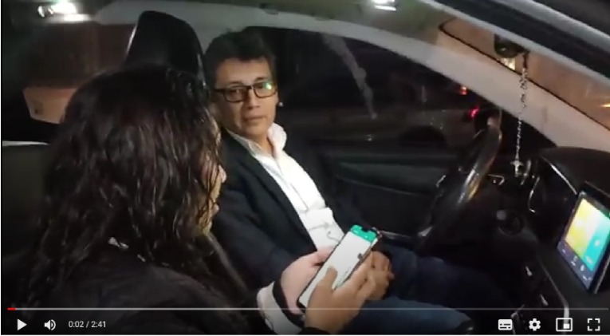
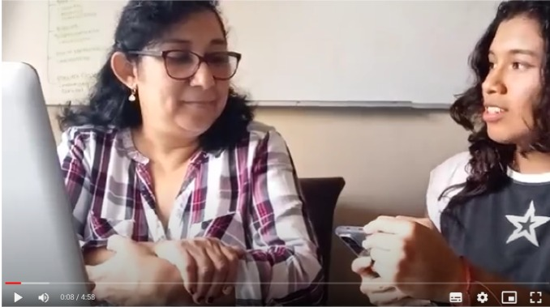

# Universidad Peruana de Ciencias Aplicadas
## Curso: Aplicaciones OpenSource
## Sección: SW55
## TB1 - EasyParkNow
### Integrantes:
* Conde Isla, Camila - u202114309
* Moreno Carmona, Oscar - u201911522
* Lastra Trinidad, Georgina - u201822503
* Onofre Ruiz, Carlos - u202115590
* Ortiz Fajardo. Tomas - u201910146

## **Capítulo I: Introducción**
### 1.1 StartUp Profile
#### 1.1.1 Descripción del StartUp
Somos “DevWorkers”, una empresa enfocada al desarrollo de tecnologías que solucionen problemáticas en el ámbito del transporte que están presentes en nuestra sociedad. “EasyParkNow”, nuestra propuesta, tiene como objetivo apoyar a los conductores a encontrar un espacio de estacionamiento libre de manera inmediata a través de su ubicación GPS y la publicación de reseñas dadas por el resto de los usuarios y, de esta manera, solucionar los problemas de congestionamiento vehicular que se generan a raíz de una falta de conocimiento sobre ellos. En principio, la aplicación será gratuita para el público en general, sin embargo, también habrá una cuenta premium que brindará a los usuarios la posibilidad de pagar desde la aplicación la reserva de un espacio libre. En primera instancia, nos enfocaremos en la zona de Lima ya que esta abarca una mayor concentración de conductores activos y zonas libres para estacionarse.
Nuestra misión es brindar información sobre la ubicación de los aparcamientos próximos al usuario en tiempo real de manera que facilitemos la búsqueda y alquiler de ellas. Nuestra visión es convertirnos en una empresa líder en el desarrollo de tecnologías que ayuden a resolver distintas problemáticas del transporte en el Perú y, eventualmente, en el mundo.

#### 1.1.2 Perfiles de integrantes del equipo

|Imagen|Integrante|
|-----:|:-----|
| |Nombre: Tomas Ortiz Fajardo / Código: U201910146 / Carrera: Ingeniería de Software Soy Tomas Ortiz Fajardo y me encuentro cursando la carrera de Ingeniería de Software. Siempre me ha gustado la programación, y tengo la suerte de poder aprender y dominar más de un lenguaje de programación, como por ejemplo Python, Javascript, C + +, entre otros. Espero poder colaborar a este trabajo lo suficiente para poder generar más buenos recuerdos y seguir aprendiendo.|
|||
| | Nombre: Oscar Sebastian Nicolas Moreno Carmona / Código: U201911522 / Carrera: Ingeniería de Software Me considero un chico comprometido con mejorar cada día y aportar mis conocimientos para poder brindar soluciones óptimas a los problemas que pueden haber en la actualidad, siempre teniendo en cuenta el impacto que tiene ambientalmente y también considerando los valores éticos con los cuales fui formado.|
| | |
| |Nombre: Onofre Ruiz Carlos Jesus / Código: U202115590 / Carrera: Ingeniería de Software Mi nombre es Carlos Jesus Onofre, tengo 19 años, estudio la carrera de Ingeniería de Software. Me considero una persona que cuenta con capacidades como el liderazgo en situaciones importantes, además del compromiso que tengo con los trabajos que se me presentan, de la misma forma soy una persona creativa con ideas que suman al equipo, asimismo mi actitud positiva hace que el proyecto no se vuelva tedioso para los integrantes de mi grupo|
|||
| |Nombre: Georgina Lastra Trinidad / Código: U201822503 / Carrera: Ingeniería de Software Mi nombre es Georgina Lastra y estudio la carrera de Ingeniería de Software. Soy una persona perseverante, creativa y comprometida. Siempre dispuesta a aprender cosas nuevas. Con mis conocimientos puedo aportar positivamente en la elaboración de nuestro proyecto. Asimismo, compartir y escuchar ideas de mis compañeros de esta manera obtener un buen resultado.|
| | |
| | Nombre: Camila Conde Isla / Código: U202114309 / Carrera: Ingeniería de Software Soy estudiante de la carrera de Ingeniería de Software en la cual me encuentro cursando el quinto ciclo de la carrera. Mi motivación para seguir aprendiendo es llegar a crear y diseñar soluciones creativas y entender mejor la tecnología. Me considero una persona creativa, proactiva, tolerante, respetuosa y apasionada por lo que me gusta. Me comprometo a apoyar en el proceso para poder tener un proyecto final bien planteado para obtener una buena nota.|

### 1.2 Solution Profile
A partir de la descripción del startup, nosotros como equipo hemos pensado en el desarrollo de una aplicación móvil el cual indicará las zonas de estacionamiento con acceso público y privado, y en este último podrás acceder a reservas, costo y espacios disponibles en tiempo real y de igual manera tendrás la opción de comparar con otros similares cerca de tu ubicación. El nombre que le daremos será “EasyParkNow”.

#### 1.2.1 Antecedentes y problemática
**WHAT(QUÉ)**

**¿Cuál es el problema?**
Actualmente, el incremento de vehículos en las calles del país ha generado una significativa reducción de espacios públicos. En el día a día miles de conductores salen a las calles con el objetivo de hacer sus actividades diarias y es por ello que muchos espacios de estacionamientos públicos están ocupados o muchos conductores desconocen sus ubicaciones, ya que no hay mucha publicidad sobre estos.

**¿Cuál es la relación con la persona en cuestión?**
El conductor, al no encontrar un estacionamiento para aparcar decide estacionarse en alguna zona no autorizada, lo cual genera congestión vehicular y en muchos casos se llega a recibir una infracción o embargo. When (Cuándo)

**¿Cuándo sucede el problema?**
Cuando el conductor necesita estacionar su vehículo y no tiene un lugar donde hacerlo, tal vez conoce algún estacionamiento, pero puede estar ocupado y no quiere perder tiempo yendo hasta ahí, o incluso puede no conocer ninguno, entonces deja su automóvil en lugares prohibidos. Where (Dónde)

**¿Dónde está el cliente cuando usa el producto?**
Por lo general, se encontrarán en las calles de Lima realizando sus actividades cotidianas.

**¿Dónde surge el problema?**
El problema surge en distintos lugares de la capital, pues día a día las personas deben salir a ejercer sus obligaciones laborales, todo depende de donde necesite dejar su automóvil. Who (Quién)

**¿Quiénes están involucrados?**
Puede estar involucrado un conductor profesional, personas que manejen un vehículo activamente o que ocurra una situación donde la persona tenga que estacionar alguno. También lo estarán los dueños de los estacionamientos que hayan registrado su espacio en nuestra plataforma.

**¿A quién le sucederá el problema?**
Principalmente a los conductores activos, ya que ellos son los más propensos a verse envueltos en este problema con mayor frecuencia.

**¿Quién lo utilizará?**
Cualquier persona que maneje un vehículo y necesite un lugar para aparcarlo, así como también los dueños de los estacionamientos que quieran registrar su estacionamiento en la aplicación.

**WHY (POR QUÉ)**

**¿Cuál es la causa del problema?**
La causa del problema es circunstancial; sin embargo, de todo esto la parte común es la poca información que tenemos en donde estacionar nuestro vehículo.

**HOW (CÓMO)**

**¿Cómo se llevan a cabo los hechos?**
Cuando el usuario no conoce ningún estacionamiento cercano y lleva tiempo sin encontrar alguno o los que conoce se encuentran llenos.

**HOW MUCH (CUÁNTO)**

**¿Cuántas personas son afectadas por esta problemática?**
De todas las multas de tránsito existentes, una gran cantidad de estas son por estacionarse en lugares prohibidos, exactamente la problemática que buscamos vencer.

#### 1.2.2 Lean UX Process
#### 1.2.2.1 Lean UX Problem Statement

Nuestro servicio ofrece un canal entre los conductores y los dueños de estacionamientos, siendo los primeros quienes presentan dificultades para encontrar un espacio libre para aparcar su vehículo. A través de nuestra plataforma, los usuarios tendrán acceso a la ubicación de los estacionamientos cercanos a ellos con información adicional como mostrar los cupos libres, los precios, reseñas de otros conductores, etc.
Hemos observado una problemática que sufren los conductores: los autos que transitan por Lima se incrementan constantemente, lo cual genera que los espacios de aparcamientos libres sean más escasos y difíciles de encontrar. Sumado a esto, la desinformación de lugares de estacionamiento disponibles y la negligencia de algunos individuos provoca que sea más común ver vehículos aparcados en zonas prohibidas. Esto provoca que los propietarios de los vehículos sean multados o en el peor de los casos embargados.
¿Cómo podemos evitar que los conductores se estacionen en lugares prohibidos a causa del desconocimiento o saturación de los estacionamientos disponibles?

#### 1.2.2.2 Lean UX Assumptions

1. **Creo que mis usuarios necesitan…** información sobre zonas de aparcamiento donde pueden estacionar su auto, ya sea estacionamientos públicos o privados

2. **Estas necesidades se pueden resolver con…** una aplicación móvil, que cumpla el propósito de mostrar zonas de estacionamientos cercanas a su ubicación y los datos necesarios para reservarlos.

3. **Mis clientes iniciales son (o serán) ...** los dueños de estacionamientos que quieran registrarse al servicio y los conductores que tengan dificultad para encontrar un estacionamiento en Lima.

4. **El valor #1 que un cliente quiere de mi servicio es…**  la ubicación en tiempo real de los estacionamientos disponibles más próximos.

5. **El cliente también puede obtener estos beneficios adicionales…** como la reserva de un estacionamiento a través de nuestra plataforma de pago y descuentos en las reservas según el tiempo de uso del aplicativo.

6. **Voy a adquirir la mayoría de mis clientes a través de…** publicidad en las principales redes sociales y anuncios por canales de comunicación como la radio y televisión.

7. **Haremos dinero a través de…** la suscripción de una membresía mensual por uso a los dueños de estacionamientos y publicidad de nuestros auspiciadores.

8. **Mi competencia principal en el mercado será…** Google Maps, siendo este uno de los mejores recursos para buscar ubicaciones en tiempo real.

9. **Los venceremos debido a…** la ausencia de un registro total de estacionamientos y una plataforma de pago por alquiler de ellos.

10. **Mi mayor riesgo de producto es…** no encontrar dueños de estacionamientos que quieren registrarse a nuestra plataforma.

11. **Resolveremos esto** ofreciendo al usuario una prueba gratuita de nuestro aplicativo por tiempo limitado.

**¿Quién es el usuario?**
Nuestros usuarios son todas aquellas personas que manejan algún vehículo y necesitan un espacio libre para estacionarse. 

**¿Dónde encaja nuestro producto en su trabajo o vida?**
En los días que los usuarios necesiten movilizarse hacia algún lugar y desconocen dónde pueden dejar aparcado su vehículo de manera segura.

**¿Cómo y cuándo es usado nuestro producto?**
Es usado como un apoyo a los conductores para guiarlos hacia el estacionamiento más conveniente para ellos. Por otro lado, es usado cuando necesitan dejar estacionado su vehículo en algún espacio libre seguro y permitido.

**¿Qué problema tendría nuestro producto y cómo se pueden resolver?**
Podría ocurrir una incorrecta vinculación de nuestra plataforma con el GPS del usuario o un incorrecto funcionamiento en nuestro canal de pago. Ambos problemas se pueden resolver a través de mantenimiento constante a nuestra plataforma (actualizaciones).

**¿Qué características son importantes?**
Nuestra plataforma debe tener un alto nivel de seguridad ya que por medio de esta se pueden efectuar transacciones. Además, debe manejar la información en tiempo real para que los usuarios tengan la información actualizada, por ejemplo, cuántos espacios libres quedan en un estacionamiento específico. Por último, debe tener una gran capacidad de memoria para poder almacenar a todos los usuarios que se registren ya que las personas que manejan algún vehículo representan un gran porcentaje de la población.

**¿Cómo debe verse nuestro servicio y cómo debe comportarse?**
Nuestro servicio debe verse como un sistema de apoyo a los conductores a través de una interfaz moderna e intuitiva. Además, debe comportarse de manera fluida y práctica para que la experiencia del usuario sea la mejor

#### 1.2.2.3 Lean UX Hypothesis Statement
Según lo propuesto en el solution profile se plantearon las siguientes hipótesis:

* **Creemos que** el uso de nuestra app permitirá al conductor identificar los aparcamientos autorizados donde podrá estacionar su vehículo, esto ayudará a disminuir la cantidad de multas. 

*Sabremos que hemos tenido éxito,*

*Cuando veamos que* la cantidad de infracciones dadas por un mal estacionamiento hayan disminuido en un 50% del total de personas que hayan instalado nuestra app en sus dispositivos.

* **Creemos que** nuestra solución será exitosa en Lima y Lima metropolitana, posicionándose como la mejor solución en la búsqueda de aparcamientos en el Perú.

*Sabremos que hemos tenido éxito,*

*Cuando vemos* que la cantidad de veces que nuestra app fue descargada supere el 40% en Lima y Lima metropolitana.

* **Creemos que** la interfaz donde se puntúe el estacionamiento según la experiencia de cada usuario que haya usado el servicio pueda ayudar a otras personas que recurran a nuestra app por el mismo problema y deseen un servicio que satisfaga sus necesidades.

*Sabremos que hemos tenido éxito,*

*Cuando veamos* mediante encuestas que el 30% de los usuarios nuevos fueron influenciados por usuarios ya registrados en nuestra app.

#### 1.2.2.4 Lean UX Canvas

### 1.3 Segmentos Objetivos
El objetivo principal de nuestro proyecto es ayudar a los conductores a localizar una zona de aparcamiento para estacionar su vehículo. Basándose en ello hemos identificado dos segmentos objetivos:

Conductores: Personas residentes de la ciudad de Lima que cuenten con un vehículo de transporte y tengan la necesidad diaria de buscar un estacionamiento.

Dueños de estacionamiento: Personas residentes de Lima que son dueños y/o manejan su propio estacionamiento o cuentan con un espacio para aparcar. Y desean tener publicidad y clientes para su estacionamiento. Al mismo tiempo, lograr registrarse en nuestra plataforma, donde podrá colocar la información de su estacionamiento. De esta manera, los conductores podrán ubicarlos fácilmente.

## **Capítulo II: Requirements Elicitation & Analysis**
### 2.1 Competidores
#### 2.1.1 Análisis Competitivo

|     |Parkner | Waze | Google Maps |
|-----|--------|------|-------------|
|Precio| Gratis | Gratis | Gratis |
|Confiabilidad| La confiabilidad de esta aplicación se basa en poder realizar un pago seguro y solo por el tiempo consumido en un estacionamiento. | La confiabilidad de esta aplicación se basa en mostrar opciones de estacionamientos seguros para poder estacionar el vehículo. | La confiabilidad de este se basa en brindar el lugar más cercano al usuario mediante el buscador.
|Información |Permite a los usuarios registrar y poner en alquiler sus espacios libres, ya sea en casas, edificios residenciales, oficinas corporativas, playas privadas, etc. Cabe destacar que Parkner es una plataforma gratuita para todos los que estén interesados en alquilar su espacio disponible, teniendo cada uno la posibilidad de determinar su propio precio y tiempo de alquiler. |Se usa cuando queremos sortear el tráfico de la ciudad, pero también es muy útil al momento de buscar donde estacionar. Solo debes entrar a la sección categorías y activar la opción estacionamiento y listo, ¡recibirás varias alternativas de estacionamiento que estén cercanas a tu ubicación.|Es una herramienta de búsqueda de ubicaciones que permite geolocalizar un punto concreto. Encontrar lugares de interés más cercano. |
|Limitaciones| Ninguna | No brinda información sobre la experiencia del usuario en ese estacionamiento. No brinda la tarifa aproximada de lo que cuesta el estacionamiento. | No se conoce el precio de los estacionamientos.No brinda información sobre la disponibilidad de los estacionamientos.
| Características Diferenciales | Reservas antes de llegar a tu destino. Encuentras estacionamiento desde tu celular. Precio seguro y justo sólo por el tiempo consumido. Libertad para elegir los horarios y las cocheras. | Cuando ya estás por llegar a tu destino, Waze te muestra opciones de estacionamientos cerca. | Es una aplicación bastante conocida y el gran porcentaje de la población la tiene instalada en su celular.|

#### 2.1.2 Estratégias frente a competidores
La estrategia que usaremos para destacar de nuestros competidores en este caso Parkner, que vendría ser una competencia directa, sería que nos diferenciamos en que nuestra app contará la seguridad de tu vehículo, ya que sabemos que parkner permite a los usuarios colocar en alquiler sus espacios libres pero no sabemos ni tenemos la certeza si el lugar es seguro, a diferencia de EasyParkNow que contamos con dueños de estacionamientos que colocan la información y seguridad para que sus vehículos estén en buenas manos.
En cuanto a Waze es un aplicación para evitar congestionamiento vehicular, siendo enfocada más como una herramienta de navegación social de coches particulares, aunque también cuenta con búsqueda de estacionamiento, a diferencia de esto nuestra aplicación busca ser fácil de usar e intuitiva teniendo en cuenta que algunos conductores están conduciendo y recurren a buscar un lugar para estacionarse  en ese momento, además de conocer las tarifas de estacionamiento en la misma app como descripción adicional.
Por último, en Google Maps nos muestra los estacionamientos que se encuentran cerca de la zona, pero sabemos que no se encuentra actualizada y a veces esto puede ser una opción poco fiable si el usuario quiere buscar un estacionamiento, además de no saber si el lugar se encuentra disponible. En cambio, nuestra aplicación muestra los lugares más cercanos tomando en cuenta la disponibilidad en la hora actual, logrando además poder reservar un espacio dentro de la zona.

### 2.2 Entrevistas
#### 2.2.1 Diseño de entrevistas
**CONDUCTORES**

¿Nos podría brindar su nombre, edad, lugar de residencia, ocupación ?

¿Cuánto tiempo le tomó encontrar un estacionamiento? 

¿Qué hace cuando no encuentra un estacionamiento?

¿Piensa que la tarifa de estacionamiento suele ser adecuada?

¿Qué es lo que considera cuando elige un estacionamiento?
 
¿Qué opina de los estacionamientos privados?
 
¿Suele encontrar estacionamiento privado cerca de su lugar de destino?

¿En qué se basa para elegir entre un estacionamiento u otro?

¿Tendría la confianza suficiente para dejar su vehículo en una cochera alquilada? 

¿Qué beneficios cree que le brindaría una aplicación que le recomiende lugares de estacionamiento cerca? 

EL PRODUCTO:

¿Qué le parecería la aplicación como solución al problema de no encontrar estacionamiento? 

¿Qué opciones o funcionalidades le gustaría incluir?
¿Usted recomendaría la aplicación a sus conocidos?

**DUEÑOS**

¿Nos podría brindar su nombre, edad, lugar de residencia, ocupación ?

¿Qué información o dato es importante para usted cuando recibe a un cliente(conductor)?

 ¿Cuál es la tarifa que dispone usted al público por sus servicios?
¿Por qué cree que es bueno conseguir un estacionamiento fijo?

¿Cuál es el tiempo promedio que ocupan los usuarios dentro del estacionamiento? ¿Por qué cree usted que sus usuarios se ocupan de este tiempo? 

¿Qué es lo que su local ofrece o se distingue de otros locales de estacionamientos cercanos?
 
¿Considera que el lugar donde está ubicado su estacionamiento le ayuda a recibir más clientes?

¿Ha tenido problemas con los tiempos de reserva de algunos clientes? ¿Cree que es mejor reservar con anticipación?

¿Cree que le conviene aceptar todo tipo de vehículos o podría haber restricciones? 

EL PRODUCTO:

¿Qué le parece la aplicación? ¿Crees que realmente le ayude a difundir más su estacionamiento?

¿Tiene alguna sugerencia con respecto a la aplicación brindada?

#### 2.2.2 Registro de entrevistas

|Conductor|         |
|---------|---------|
|Nombres y Apellidos| Reyner Chuquinaupa|
|Edad| 53|
|Distrito | San Miguel |
|En la entrevista Reyner nos comenta su experiencia del problema de no conseguir estacionamiento de forma rápida y fácil. Nos cuenta que desde su punto de vista hay variedad en precios de estacionamientos pero los más conocidos son los más caros. Casi siempre encuentra estacionamientos lejos de su destino porque desconoce el funcionamiento de uno cerca. Para él es muy importante el acceso y el precio al momento de elegir un estacionamiento. Considera que la aplicación es útil por indicar el precio y  anticipar un estacionamiento antes de llegar al destino. | |

|Dueño|         |
|---------|---------|
|Nombres y Apellidos| Ericka Isla Ruiz|
|Edad| 48|
|Distrito | San Miguel |
|La señora Ericka nos comenta que lo más importante antes de vender o alquilar es la identificación del conductor y la placa del vehículo para evitar problemas. Considera que la tarifa debe ser más económica que los grandes estacionamientos incluyendo una tarifa por minutos, algo que no se considera en las empresas grandes. Dice que es importante poder incluir una función de reserva, publicar promociones por uso de estacionamiento | |

